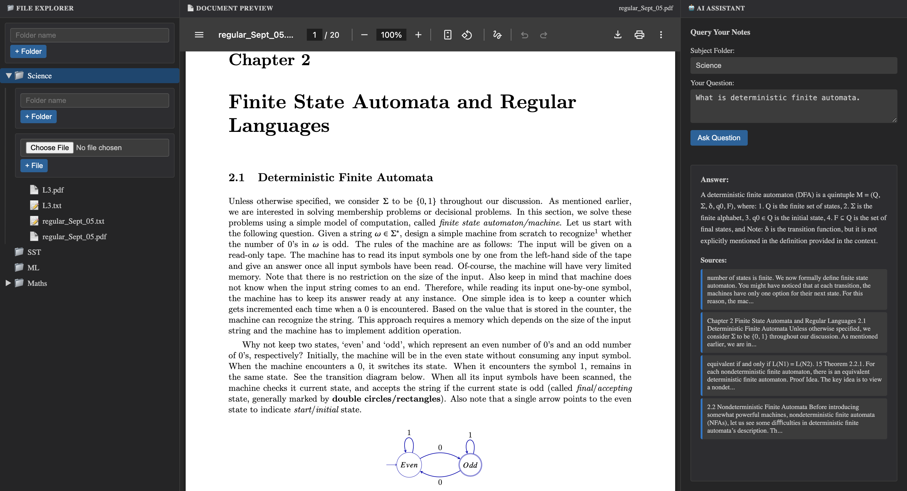

# NoteScanner

## Overview
NoteScanner is an end-to-end pipeline for uploading, extracting, embedding, and querying notes using OCR, ChromaDB, and Groq LLM. It features a FastAPI backend and a React/Vite frontend, orchestrated with Docker Compose.

You upload your handwritten notes → the system scans, organizes, and lets you chat with your notes using Retrieval-Augmented Generation (RAG).



## Prerequisites
- Docker & Docker Compose
- Python 3.10+
- Node.js 20+
## Quick Start (Recommended: Docker Compose)

1. **Clone the repository:**
	```sh
	git clone https://github.com/cherie-dips/NoteScanner
	cd NoteScanner
	```

2. **Set up environment variables:**
	- Add your `GROQ_API_KEY`.

3. **Build and run all services:**
	```sh
	docker-compose up --build
	```
	- Backend: http://localhost:8000
	- Frontend: http://localhost:5173

## Manual Setup (Dev Mode)

### Backend
1. Create and activate a Python virtual environment:
	```sh
	python3 -m venv venv
	source venv/bin/activate
	pip install -r requirements.txt
	```
2. Set up `.env` with your API keys.
3. Start the backend:
	```sh
	uvicorn backend.api:app --host 0.0.0.0 --port 8000
	```

### Frontend
1. Install dependencies:
	```sh
	cd frontend/my-app
	npm install
	```
2. Start the frontend:
	```sh
	npm run dev -- --host
	```
3. Access at http://localhost:5173

## Workflow
1. **Create folders and upload notes (PDFs/images) via frontend.**
2. **Backend extracts text (OCR for images, PyMuPDF for PDFs) and saves `.txt` files.**
3. **Extracted text is chunked and embedded using SentenceTransformer, stored in ChromaDB.**
4. **Query your notes by subject and question.**
	- Backend retrieves relevant chunks and uses Groq LLM to answer.

## Useful Commands
- **Rebuild containers:**
  ```sh
  docker-compose up --build
  ```
- **Stop containers:**
  ```sh
  docker-compose down
  ```

## Deploy to GitHub Pages

The frontend can be deployed to **https://&lt;username&gt;.github.io/NoteScanner/**.

1. **Enable GitHub Pages (one-time):**
   - In your repo: **Settings → Pages**
   - Under **Build and deployment**, set **Source** to **GitHub Actions**.

2. **Deploy:**
   - Push to the `main` branch (or run the workflow from the **Actions** tab).
   - The **Deploy to GitHub Pages** workflow will build the frontend and deploy it.
   - After it finishes, the site will be live at `https://<username>.github.io/NoteScanner/`.

3. **Backend for the deployed site:**
   - GitHub Pages only serves the static frontend. For explorer, uploads, and AI query to work, the backend must be running and reachable.
   - Either run the backend locally and use the same machine to open the GitHub Pages URL, or deploy the backend (e.g. Railway, Render) and set `VITE_API_URL` in the workflow to your backend URL before building (e.g. add an env var in the “Install and build” step).

## File Structure
- `backend/` - FastAPI endpoints, extraction, ingestion, query logic
- `frontend/my-app/` - React/Vite frontend
- `user_notes/` - Uploaded notes and extracted text (ignored in git)
- `chroma_storage/` - ChromaDB vector database (ignored in git)
- `.env` - Secrets and API keys (ignored in git)

## Future Steps
- Adding a functionality to perform OCR on handwritten PDF documents. 