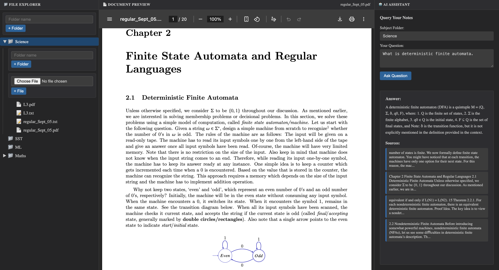

# NoteScanner

**A study assistant that works from your own notes.**

Upload your course notes (PDFs, photos of handwritten pages, text files or OneNote pages). Then ask
questions and get answers taken from those notes, with the exact file and page they came from.
NoteScanner can also make flashcards and practice quizzes from your notes, remind you when cards are
due for review, and build a day-by-day revision plan before an exam.



---

## The problem

When exams come close, most students run into the same problems:

- **Notes are scattered.** Slides from the professor, scanned handouts, phone photos of a friend's
  notebook, a few OneNote pages. Finding one explanation means opening ten files.
- **Handwritten notes and scanned pages can't be searched.** Ctrl+F doesn't work on a photo.
- **General chatbots don't know your course.** They answer from the internet, so the method,
  notation or definition can differ from what your class taught, and you can't easily tell which
  parts to trust.
- **Making study material takes time.** Writing flashcards and practice questions by hand is slow,
  so most students skip it and just re-read.
- **Cramming doesn't stick.** Reviewing a little every day works better, but it's hard to keep track
  of what to review and when.

## What NoteScanner does about it

| Problem | What NoteScanner does |
|---|---|
| Notes are scattered | One place for all your notes, organised in folders (one folder per course). |
| Photos and scans can't be searched | Reads the text out of every PDF and photo, including handwriting, so all of it can be searched. You can view and correct that text. |
| Chatbots don't know your course | Answers come from **your notes first**, with clickable sources (file and page). If the notes don't fully cover a question, anything added from general knowledge is clearly marked **📖 Beyond notes**. |
| Making study material is slow | Makes flashcards, multiple-choice quizzes (with explanations) and short summaries from any file in one click. |
| Cramming doesn't stick | Saves flashcards into decks and shows each card again at the right time (cards you know come back less often). A "Today" dashboard, an exam planner, and an optional daily reminder email. |

It is built for students in India: answers and study material can be written in English or in one of
10 Indian languages (Hindi, Bengali, Gujarati, Kannada, Malayalam, Marathi, Odia, Punjabi, Tamil,
Telugu).

---

## Features

**Your notes**
- Folders and files: upload many files at once (or drag and drop), rename, move, delete.
- Uploads are processed in the background, with progress shown for each file.
- Mark a file as a **main source** (for example, the professor's official notes) so answers prefer it.
- **Text view**: see the text NoteScanner read from a file, fix reading mistakes, or type notes into a new file.
- **OneNote import** (when Microsoft sign-in is set up).
- Your original PDFs and photos stay on your device for viewing. The server keeps only the text read from them.

**Ask your notes**
- Answers appear word by word as they are written, with sources you can click (with page numbers for PDFs).
- Select any passage in a file and choose **Ask about this**.
- Attach a file to just one chat with the **+** button, without saving it to your notes.
- Math is shown properly (fractions, equations, symbols).

**Study tools**
- Flashcards and multiple-choice quizzes (with a score and explanations), made from the open file.
- Optional: make flashcards automatically for every upload.
- Short 100–150 word summaries of a file.
- Saved decks with spaced review (Again / Hard / Good / Easy). Export a deck as CSV for Anki.
- **Today** dashboard: cards due, streak, weak topics (from quiz scores), last 14 days of activity.
- **Exam mode**: a day-by-day revision plan up to an exam date, and timed mock tests from a whole course folder.

**Accounts and running a pilot**
- Sign up, sign in, change or reset password (by email), delete account.
- Works on phones, and can be added to the home screen like an app.
- New accounts get a "Getting started" folder with sample notes, so the first question works right away.
- 👍 / 👎 on every answer and a feedback form.
- Admin page with usage, estimated AI cost and feedback; an optional monthly AI budget.
- Error alerts to Slack or Discord, weekly encrypted backups, and an uptime check.

---

## How it works

NoteScanner has three main flows: **saving a note**, **answering a question**, and **making study material**.

### 1. Saving a note

```
 You upload a file
        │
        ▼
 Quick check: type and size ──► file is queued, you see "processing"
        │
        ▼
 Read the text out of the file
   • PDF   → Sarvam Vision  (backup: PyMuPDF reads the PDF's built-in text)
   • Photo → Sarvam Vision  (backup: Tesseract)
   • .txt / .md / .csv / .json / .log → used as is
        │
        ▼
 Note which page each part of the text came from (PDFs)
        │
        ▼
 Cut the text into short overlapping passages (about 750 characters each)
        │
        ▼
 Turn each passage into a "meaning fingerprint" (a list of numbers that
 captures what the passage is about). This runs on our own server, for free.
        │
        ▼
 Save passages + fingerprints in ChromaDB, and the full text separately
        │
        ▼
 Only now does the file appear in your folder. If any step fails, you see an error and
 the file never shows up half-saved.
```

Reading a long scanned PDF can take a minute or two, which is why this happens in the background.

### 2. Answering a question

```
 You ask a question (optionally about a highlighted passage)
        │
        ▼
 Turn the question into a meaning fingerprint
        │
        ▼
 Look for the closest-matching passages, in this order:
   1. Files attached to this chat with +   (kept in memory for 2 hours, never saved)
   2. The file you have open
   3. Other files in the same course folder
   4. All your other notes
 Use the first place that has a good enough match. If none does, use the best match found.
 Keep up to 8 passages. Files marked "main source" get a small boost.
        │
        ▼
 Send the question + those passages to Sarvam AI (sarvam-105b) with these rules:
   • Use the notes first and refer to them.
   • If the notes don't fully answer it, add standard textbook knowledge for the
     same subject and label it "📖 Beyond notes".
   • Stay within the course's subject.
   • Write in the student's chosen language.
        │
        ▼
 The answer streams back to you, with the source files and page numbers.
```

Search works by **meaning**, not exact words: a question about "how fast a reaction happens" can
find a passage about "rate of reaction".

### 3. Making study material

```
 You open a file and choose Flashcards, Quiz or Summary
        │
        ▼
 Collect the text: the open file, plus short parts of other files in the same course folder
        │
        ▼
 Send it to Sarvam AI (sarvam-30b):
   • Flashcards and quizzes: about 70% straight from the notes, about 30% on closely
     related topics from the same subject (those are labelled "📖 Beyond notes")
   • Quizzes: 4 options each, one-line explanation, answer order shuffled
   • Summaries: 100–150 words, only from the notes
        │
        ▼
 Check the result is in the right format. Retry up to 3 times if not.
 If it still fails, show an error. NoteScanner never makes up questions on its own,
 because a wrong answer key is worse than no answer key.
```

Saved flashcards follow the same idea as Anki: each time you review a card you grade it
(Again / Hard / Good / Easy), and NoteScanner decides when to show it next. Easy cards come back
after longer and longer gaps; cards you forget come back in 10 minutes.

---

## Tech stack

| Part | Tool | What it's used for |
|---|---|---|
| **Website** | React 19 + Vite | The app you see in the browser. |
| | react-markdown, KaTeX | Showing formatted answers and math. |
| **Server** | Python 3.11 + FastAPI (run with Uvicorn) | Handles sign-in, uploads, questions and study tools. |
| **Reading files** | Sarvam Vision (Sarvam AI Document Intelligence) | Reads text from PDFs, scans and handwriting. |
| | PyMuPDF | Backup for PDFs that already contain text. |
| | Tesseract | Backup for photos of printed text. |
| **Search by meaning** | `all-MiniLM-L6-v2` (sentence-transformers) | A small free model, running on our server, that makes the "meaning fingerprints". |
| | LangChain text splitter | Cuts notes into short passages. |
| **Storage** | ChromaDB (Chroma Cloud or self-hosted) | Stores note passages and finds the closest matches to a question. Also stores accounts, folders, decks and usage. |
| **Writing answers** | Sarvam AI chat models | `sarvam-105b` writes answers; `sarvam-30b` writes flashcards, quizzes and summaries. |
| **Passwords** | bcrypt | Passwords are stored scrambled, never as plain text. |
| **Hosting** | GitHub Pages | Hosts the website. |
| | Hugging Face Spaces (Docker) | Hosts the server. |
| | GitHub Actions | Runs tests on every change, deploys, makes weekly backups, checks the site is up. |
| **Testing** | pytest, ESLint | Server tests and website code checks. |

Why Sarvam AI: it is built for Indian languages, which is what lets NoteScanner answer in 10 of them.

---

## Project structure

```
NoteScanner/
├── backend/                     The server (Python)
│   ├── api.py                   Starts the app: error handling, request limits, /health, /config
│   ├── settings.py              All settings, limits and search thresholds in one place
│   ├── routes/                  The server's web addresses, grouped by feature
│   │   ├── account.py           Sign up, sign in, passwords, preferences, delete account
│   │   ├── files.py             Folders, uploads, renaming, moving, viewing and editing text
│   │   ├── chat.py              Asking questions, chat attachments (+)
│   │   ├── study.py             Flashcards, quizzes, summaries, decks, Today, exam mode
│   │   ├── onenote.py           OneNote connect and import
│   │   └── admin.py             Usage and feedback page for admins
│   │
│   ├── uploads.py               Reads text out of files; background upload queue
│   ├── extract_api.py           Tesseract backup for photos
│   ├── pages.py                 Works out page numbers for PDF text
│   ├── ingest_api.py            Cuts text into passages and makes meaning fingerprints
│   ├── search.py                Finds the passages that answer a question
│   ├── llm_pipeline.py          Everything that talks to Sarvam AI: reading files, answers, study material
│   ├── chat_cache.py            Files attached to one chat (memory only, deleted after 2 hours)
│   ├── study_store.py           Saved decks and the review schedule
│   ├── chroma_store.py          All reads and writes to ChromaDB
│   ├── vfs_tree.py, paths.py, file_meta.py   Folder tree and file details (e.g. "main source")
│   ├── auth.py, deps.py         Passwords, sign-in sessions, who is making a request
│   ├── rate_limit.py            Request limits
│   ├── usage.py                 Daily usage per student, estimated AI cost, monthly budget
│   ├── preferences.py           Answer language, reminder settings
│   ├── reminders.py, mailer.py  Daily review emails and password-reset emails
│   ├── feedback.py, alerts.py   Answer ratings and feedback; error alerts to Slack/Discord
│   ├── onenote_sync.py          Imports OneNote pages through Microsoft sign-in
│   ├── starter_notes.py         "Getting started" folder for new accounts
│   └── legacy_migration.py      One-time move of data saved by older versions
│
├── frontend/my-app/             The website (React)
│   ├── public/                  Icons, app screenshot, files that let it install on phones
│   └── src/
│       ├── pages/               Full pages: Home (main app), Login, Register, ResetPassword, ChatPage (signed-out landing)
│       ├── components/          Parts of the page: Explorer (folders), QueryInterface (chat),
│       │                        StudyPanel, StudyDecks, StudyToday, ExamMode, FileTextView,
│       │                        upload progress, settings, feedback, privacy note, admin page
│       ├── auth.js, config.js   Sign-in state and the server address
│       ├── localFileStore.js    Keeps your original files on your device for viewing
│       ├── localDiskFolder.js   Optional: mirror your folders into a "NoteScanner" folder on your computer
│       └── studyApi.js, studyUtils.js, chatHistory.js, virtualPath.js   Small helpers
│
├── scripts/                     backup_chroma.py, restore_chroma.py, answer_quality.py
├── evals/                       Sample questions for the answer-quality test (see evals/README.md)
├── tests/                       Server tests (pytest)
├── .github/workflows/           Tests, deploys, weekly backup, uptime check
├── Dockerfile                   Builds the server for Hugging Face Spaces
├── docker-compose.yml           Runs server + website + ChromaDB together on your computer
├── requirements.txt             Python packages (requirements-dev.txt adds test tools)
└── DEPLOYMENT.md                How to put it online
```

---

## Running it on your computer

### 1. Create a `.env` file

In the project root, create a file named `.env`:

```bash
SARVAM_API_KEY=your-sarvam-key

# Option A: Chroma Cloud
CHROMA_API_KEY=...
CHROMA_TENANT=...
CHROMA_DATABASE=...

# Option B: your own ChromaDB (Docker Compose below starts one for you)
# CHROMA_HOST=localhost
# CHROMA_PORT=8100
```

Get a Sarvam API key at [sarvam.ai](https://www.sarvam.ai). Without one, uploads fall back to
PyMuPDF and Tesseract, but questions and study tools won't work.

### 2a. With Docker (easiest)

```bash
docker compose up --build
```

- Website: http://localhost:5173
- Server: http://localhost:8000 (interactive API docs at http://localhost:8000/docs)
- ChromaDB: http://localhost:8100

### 2b. Without Docker

You need Python 3.11, Node 20, and Tesseract (`brew install tesseract` on macOS,
`apt install tesseract-ocr` on Ubuntu). For storage, use Chroma Cloud or start just ChromaDB with
`docker compose up chromadb`.

```bash
# Server
python3.11 -m venv venv && source venv/bin/activate
pip install -r requirements-dev.txt
uvicorn backend.api:app --host 0.0.0.0 --port 8000

# Website (in a second terminal)
cd frontend/my-app
npm ci
npm run dev -- --host
```

The first start downloads the small search model (about 90 MB), so it takes a little longer.

### Tests

```bash
python -m pytest -q tests                        # server (no internet or AI key needed; Tesseract required)
cd frontend/my-app && npx eslint . && npm run build   # website
```

Both run automatically on every push and pull request (`.github/workflows/ci.yml`).

---

## Putting it online

- Website → **GitHub Pages**, deployed on every push to `main`.
- Server → **Hugging Face Spaces** (Docker), deployed on every push to `main` once `HF_TOKEN` is set.

Step-by-step instructions, backups and checks are in [DEPLOYMENT.md](DEPLOYMENT.md).

> Run the server as **one process** (one Uvicorn worker). Upload jobs, chat attachments and request
> limits are kept in the server's memory.

---

## Reference

### Settings

**Required:** `SARVAM_API_KEY`, plus ChromaDB settings:
`CHROMA_API_KEY`, `CHROMA_TENANT`, `CHROMA_DATABASE` (Chroma Cloud) **or** `CHROMA_HOST`,
`CHROMA_PORT`, `CHROMA_SSL` (your own ChromaDB).

**Optional** (default in brackets):

| Area | Settings |
|---|---|
| Sarvam AI | `SARVAM_API_BASE`, `SARVAM_MODEL_RAG` (`sarvam-105b`), `SARVAM_MODEL_STUDY` (`sarvam-30b`), `SARVAM_DOC_INTEL_LANGUAGE` (`en-IN`), `SARVAM_DOC_INTEL_TIMEOUT` (180 s) |
| Security and sizes | `CORS_ORIGINS` (localhost + `https://cherie-dips.github.io`), `SESSION_TTL_DAYS` (14), `MAX_UPLOAD_MB` (20), `MAX_CHAT_UPLOAD_CHARS` (300000), `CHAT_CACHE_TTL_SECONDS` (7200), `USER_DOCUMENT_MAX_BYTES` (2000000), `RATE_LIMIT_MULTIPLIER` (1) |
| Password-reset email | `FRONTEND_URL`, `SMTP_HOST`, `SMTP_PORT` (587), `SMTP_USERNAME`, `SMTP_PASSWORD`, `SMTP_FROM`, `SMTP_STARTTLS` (true). Turned on only when `SMTP_HOST` and `SMTP_FROM` are set. |
| OneNote | `MICROSOFT_CLIENT_ID`, `MICROSOFT_CLIENT_SECRET`, `MICROSOFT_REDIRECT_URI` |
| Pilot | `ADMIN_EMAILS`, `ALERT_WEBHOOK_URL`, `AI_PRICE_PER_PAGE`, `AI_PRICE_PER_1K_INPUT_TOKENS`, `AI_PRICE_PER_1K_OUTPUT_TOKENS`, `AI_PRICE_CURRENCY` (INR), `AI_MONTHLY_BUDGET` (0 = off), `APP_TIMEZONE` (Asia/Kolkata), `REMINDER_HOUR` (8), `REMINDERS_ENABLED` (true), `STARTER_NOTES` (true) |

Search thresholds (how close a match must be before it's used) are the `MIN_SCORE_*` values in
`backend/settings.py`.

### Request limits

Limits stop password guessing and keep AI costs predictable. They are the `LIMIT_*` values in
`backend/settings.py`; `RATE_LIMIT_MULTIPLIER` raises or lowers all of them at once.

| What | Limit |
|---|---|
| Any request | 1200 / minute per network address, 300 / minute per signed-in browser (`/health` is never limited) |
| Sign-up / login | 50 sign-ups per hour per address; 10 login attempts per 15 min per email and address |
| Password checks, forgot / reset password | 10 per 15 min per user; 3 reset emails per hour per email; 20 reset attempts per hour per address |
| Uploads (notes and chat attachments) | 30 per 10 min and **200 per day** per user |
| Questions | 60 per 10 min and **300 per day** per user |
| Flashcards / quizzes / summaries | 20 per 10 min and **100 per day** per user |
| Folder changes, saving edited text, decks | 120 per minute; 60 per 10 min; 60 per 10 min per user |
| Delete all notes, OneNote connect / sync | 5 per hour; 10 and 5 per 10 min per user |

Going over a limit returns HTTP `429` with a `Retry-After` header and a clear message, such as
"You've reached the daily limit of 300 questions…". Counters reset when the server restarts.

### API routes

Sign-in uses the `X-Session-Id` header. Sessions end after `SESSION_TTL_DAYS` (default 14). Anything
that saves data or uses AI needs a signed-in user. Full interactive docs are at `/docs` on the running server.

| Area | Routes |
|---|---|
| Accounts | `POST /register`, `POST /login`, `POST /logout`, `GET /me`, `GET /guest_id`, `POST /account/change_password`, `POST /account/delete`, `POST /password/forgot`, `POST /password/reset`, `GET/POST /account/preferences` |
| Files | `GET /list_tree`, `POST /create_folder`, `POST /create_file`, `POST /upload_note`, `GET /jobs`, `GET /jobs/{job_id}`, `POST /move_path`, `POST /rename_path`, `POST /delete_path`, `GET/POST /file_text`, `GET/POST /file_meta`, `DELETE /notes` |
| Chat | `POST /query_folder`, `POST /query_folder/stream`, `POST /chat/upload_ephemeral`, `POST /chat/session/clear` |
| Study | `POST /study/generate`, `POST /study/summary` (old name `/study/mindmap` still works), `POST /study/decks`, `GET /study/decks`, `GET /study/decks/{id}/cards`, `POST /study/cards/{id}/review`, `DELETE /study/decks/{id}`, `GET /study/decks/{id}/export`, `GET /study/dashboard`, `POST /study/mcq_results`, `POST /study/exam`, `POST /study/exam_plan`, `GET /study/exams`, `DELETE /study/exams/{id}` |
| Feedback and admin | `POST /feedback`, `GET /admin/stats`, `GET /admin/feedback` (admins only) |
| OneNote | `GET /integrations/onenote/status`, `GET /integrations/onenote/auth_url`, `GET /integrations/onenote/callback`, `POST /integrations/onenote/sync` |
| Service | `GET /health`, `GET /config` |

`/query_folder/stream` sends one JSON object per line: first `meta` (the sources), then `delta`
lines with pieces of the answer, then `done` (or `error`).

### What is stored where (ChromaDB collections)

| Collection | Contents |
|---|---|
| `users`, `sessions`, `password_resets` | Accounts and sign-ins (only a scrambled copy of each reset link is kept) |
| `user_documents` | The full text of every file |
| `user_{id}_notes` | Searchable passages, their meaning fingerprints, and file path / course / page |
| `user_{id}_vfs` | The folder tree and file details |
| `user_{id}_study` | Decks, cards and their review schedule, quiz results, exam plans |
| `usage_daily`, `feedback` | Daily usage counts per student; ratings and feedback |
| `onenote_tokens`, `onenote_oauth_states` | OneNote connection |

Chroma Cloud allows at most 300 records per read or write, 16 KB per record and ids of up to 128 bytes.
`chroma_store.py` splits reads, writes and large files to fit, so big libraries and long file names work.
